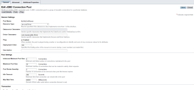
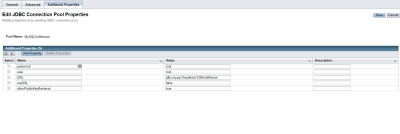
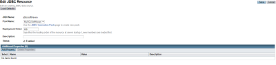
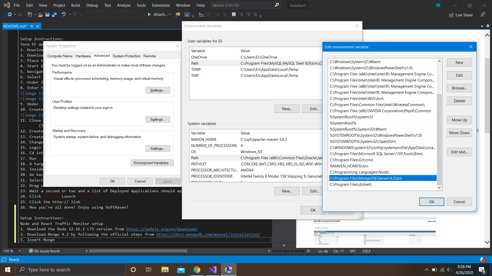
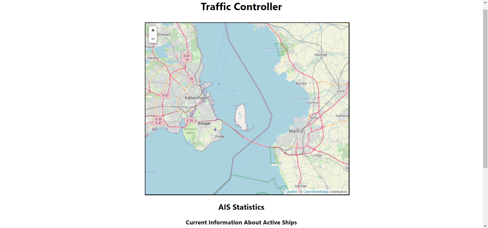

# Knuth
## 'Donald Knuth' Team Repository

<strong>There are two sections to the Final Project</strong>
1. Jave EE application
2. JavaScript application

### Setup Instructions
<strong>Java EE application SoftHaven setup</strong>
1. Download the Glassfish 4.1 installation from https://javaee.github.io/glassfish/download
2. Download the MySQL Connector J 8.0.19 from https://dev.mysql.com/downloads/connector/j/
3. Place the <code>mysql-connector-java-8.0.19.jar</code> file into the <code>glassfish4/glassfish/lib/</code> folder
4. Start Glassfish with the <code>glassfish4/bin/asadmin.bat</code> untility using the command <code>start-domain</code> (<code>stop-domain</code> to stop the server)
5. Navigate in your web browser to http://localhost:4848 
6. Select the option in the navigation bar on the left side under <strong>Resources</strong> that says <strong>JDBC</strong>
7. Under JDBC Connection Pools, create a new pool
8. Enter the information provided below and save 
 
 
9. Under <strong>Resources</strong> that says <strong>JDBC</strong> in the navigation bar select JDBC Resources
10. Create a new Resources with the information provided below and save 
 
11. Clone the repo
        (The Java side is inside the <strong>SoftHaven</strong> folder.)
12. Create a folder in the <code>src/main/java/com/sofhaven/</code> called <code>config</code>.
13. Create a file in that directory call Database.java and paste in the code from the <code>src/main/resources/com/softhaven/config/Database_PLACEHOLDER.java.txt</code>.
14. Change the username and password variables to match your own MySQL credentials. 
15. Login to your MySQL server and import the <code>softhaven.sql</code> located in the repository root directory
16. Cd into the <code>Softhaven</code> directory 
17. Run <code>mvn package</code> (Make sure you have Maven CLI installed on your machine for this!!!)
18. A target folder should appear
19. Inside that folder there should be a <code>SoftHaven.war</code> file
20. Go back to http://localhost:4848/ and click <strong>Home</strong> in the top left corner of the screen
21. Select <strong>Deploy and Aplication</strong>
22. Drag or select from the file explorer your <code>SoftHaven.war</code> file and click <strong>OK</strong>
23. Wait a second or two and a list of Deployed Applications should appear with Softhaven present
24. Click <strong>Launch</strong>
25. Click the http:// link
26. Now you're all done! Enjoy using SoftHaven!

<strong>Node and React Traffic Monitor setup</strong>
1. Download the Node 12.16.2 LTS version from https://nodejs.org/en/download/
2. Download Mongo 4.2 by following the official steps from https://docs.mongodb.com/manual/installation/
3. Insert Mongo bin folder directory into Path environment variables for command line execution. 
    These windows are provided in the image below for a Windows installation. 

5. Open up the terminal and type <code>mongo</code> to log into the Mongo database server.
6. While in Mongo, execute <code>use TrafficManager</code> to create the database.
7. Continuing in Mongo, execute <code>db.createCollection("aisMessage")</code>  to create the aisMessage collection.
8. Execute <code>use DenmarkTraffic</code> to create the database for the <code>ais_transmitter</code>.
9. Lastly in Mongo, execute <code>db.createCollection("aisdk_201809")</code>  for the <code>ais_transmitter</code>.
10. Clone the repository at https://github.com/nicolasrenet/Knuth.git.
   (Both the <code>TrafficService</code> and the <code>trafficmonitor</code> folders will be used for this application.
11. Ensure that <code>ais_transmitter</code> is installed in the same directory as the <code>Knuth</code> directory.
12. cd into the <code>ais_transmitter</code> directory, run <code>npm install</code> to download any necessary dependencies.
13. cd into the <code>trafficmonitor</code> directory, run <code>npm install</code> to download any necessary dependencies.
14. Lastly, cd in the <code>TrafficService</code> directory and run <code>npm install</code> to download any necessary dependencies.
15. Open up a new terminal and run <code>mongod</code> to start the MongoDB server.
16. Return to the the previous terminal, cd to the <code>TrafficService</code> directory, and run <code>npm start</code> to start the backend server.
17. Open a new terminal and cd into the <code>ais_transmitter</code> directory, and run <code>node index.js</code> to start the application.
17. Open a new terminal an cd into the <code>trafficmonitor</code> directory, and run <code>npm start</code> to start the application. 
    (If prompted about running the application on another port, type in "y").
18. Go to the URL listed by the <code>trafficmonitor</code> program (which should be http://localhost:3001). 
    The final application should look similar to the image below.

19. Now you're all complete! Enjoy using Traffic Monitor!

### Project Structure
<strong>AIS Transmitter</strong> 
<ul>
    <li><i>Purpose</i>: Program used to simulate the uploading of vessel AIS messages.</li>
    <li><i>Location</i>: Contained within the <code>ais_transmitter</code> directory.</li>
    <li><i>Application Uses</i>: Information used by the JavaScript application.</li>
</ul>
<strong>Softhaven</strong> 
<ul>
    <li><i>Purpose</i>: Program used by ship masters, ship agents, customs officers to view vessel information and arrival/departure forms.</li>
    <li><i>Location</i>: Contained within the <code>Softhaven</code> directory.</li>
    <li><i>Application Uses</i>: Used within the JavaEE application.</li>
</ul>
<strong>Traffic Monitor</strong> 
<ul>
    <li><i>Purpose</i>: Frontend application to view AIS messages through a map GUI and showcases related statistics.</li>
    <li><i>Location</i>: Contained within the <code>trafficmonitor</code> directory.</li>
    <li><i>Application Uses</i>: Used within the JavaScript application.</li>
</ul>
<strong>TrafficService</strong> 
<ul>
    <li><i>Purpose</i>: Backend REST service used by anyone to interact with any data contained within recent AIS messages.</li>
    <li><i>Location</i>: Contained within the <code>TrafficService</code> directory.</li>
    <li><i>Appliction Uses</i>: Used within the JavaScript application.</li>
</ul>

